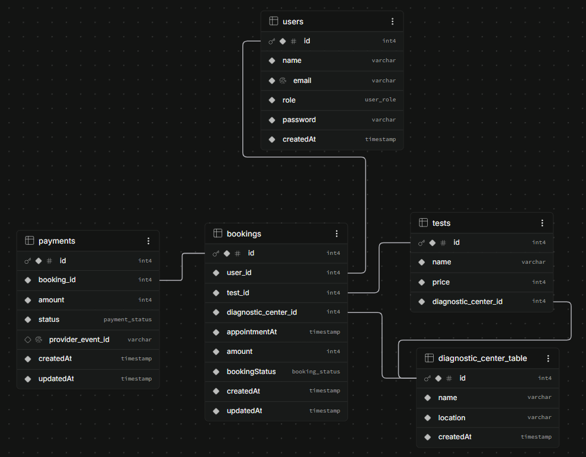

# Diagnostic Booking API

Backend service for diagnostic-centre test bookings and simulated payments, built for the EVE Healthcare SDE Intern assignment.

## Stack

- Bun and TypeScript
- Express 5
- PostgreSQL
- Drizzle ORM
- Redis and ioredis
- JWT authentication stored in an HTTP-only cookie
- Zod request validation
- Docker Compose

## Run Locally without docker

Prerequisites:

- Bun
- PostgreSQL
- Redis, unless using Docker Compose for Redis

1. Create `server/.env` using `server/.env.example`.
2. Set `DATABASE_URL` to a PostgreSQL connection string.
3. From the repository root, run:

```bash
cd server
bun install
bun run dev
```

The API runs on `http://localhost:3000` when `PORT=3000` is configured.

## Run With Docker Compose

Create `server/.env` using `server/.env.example`, set `DATABASE_URL`, and run from the repository root:

```bash
docker compose up --build
```

The API is available at `http://localhost:3000`. Redis runs as the `alpine-redis` Compose service.

To stop the services:

```bash
docker compose down
```

## Environment Variables

See [`server/.env.example`](server/.env.example).

`DATABASE_URL` must point to a PostgreSQL database. Redis is configured for the Docker Compose hostname `alpine-redis`; for a non-Docker local Redis instance, update the Redis host in `server/src/lib/redis.ts`.

## Admin Login

There is no public admin signup endpoint. An admin account must already exist in the database with the `ADMIN` role.

For this assignment, use the seeded admin credentials:

```json
{
  "email": "admin123@gmail.com",
  "password": "eve-health-app-password"
}
```

Use `POST /api/v1/auth/admin/login` to receive the admin authentication cookie.

## Authentication

Regular users can sign up and log in:

```http
POST /api/v1/auth/signup
POST /api/v1/auth/login
```

Successful login sets an HTTP-only `token` cookie. Authenticated requests should send that cookie.

## API Endpoints

Base URL: `http://localhost:3000/api/v1`

| Method | Endpoint                              | Access   | Description                                         |
| ------ | ------------------------------------- | -------- | --------------------------------------------------- |
| POST   | `/auth/signup`                        | Public   | Create a user account                               |
| POST   | `/auth/login`                         | Public   | Log in as a user                                    |
| POST   | `/auth/admin/login`                   | Public   | Log in using the seeded admin account               |
| GET    | `/diagnostic-centers?pageNumber=1`    | User     | List diagnostic centres with page-number pagination |
| GET    | `/diagnostic-centers/:centerId/tests` | User     | List tests available at a centre                    |
| POST   | `/diagnostic-centers/add-center`      | Admin    | Add a diagnostic centre                             |
| DELETE | `/diagnostic-centers/:centerId`       | Admin    | Delete a diagnostic centre                          |
| GET    | `/tests/:testId`                      | User     | Get test details and price                          |
| POST   | `/tests/add`                          | Admin    | Add a test to a diagnostic centre                   |
| POST   | `/bookings`                           | User     | Create a pending booking                            |
| GET    | `/bookings/:bookingId`                | User     | Get an owned booking and latest payment             |
| PATCH  | `/bookings/:bookingId/cancel`         | User     | Cancel a pending owned booking                      |
| DELETE | `/bookings/cancel/:bookingId`         | User     | Alternate cancellation endpoint                     |
| POST   | `/payments`                           | User     | Start simulated payment for an owned booking        |
| GET    | `/payments/:paymentId`                | User     | Get an owned payment                                |
| POST   | `/payments/webhook`                   | Provider | Process a simulated payment status update           |

## Booking and Payment Flow

1. Create a booking. The server verifies that the test belongs to the selected centre and takes the amount from the database test price.
2. The booking starts as `PENDING`.
3. Create a payment for the booking. The server creates a pending payment and starts the fake provider asynchronously.
4. The fake provider sends a webhook with `SUCCESS` or `FAILED`.
5. A successful payment changes the booking to `CONFIRMED`; a failed payment changes it to `FAILED`.
6. Pending bookings can be cancelled by their owner.

Example booking request:

```bash
curl -X POST http://localhost:3000/api/v1/bookings \
  -H "Content-Type: application/json" \
  -H "Cookie: token=YOUR_JWT" \
  -d '{"testId":1,"diagnosticCenterId":1,"appointmentTime":"2026-10-01T10:00:00.000Z"}'
```

Example payment request:

```bash
curl -X POST http://localhost:3000/api/v1/payments \
  -H "Content-Type: application/json" \
  -H "Cookie: token=YOUR_JWT" \
  -d '{"bookingId":1}'
```

## Webhook Idempotency

`POST /api/v1/payments/webhook` requires the `X-Webhook-Secret` header and accepts an event ID, payment ID, and status.

Webhook processing:

- Locks the payment and booking rows in one database transaction.
- Stores the provider event ID.
- Uses a unique constraint on `providerEventId`.
- Ignores already-finalized payments and repeated events.
- Updates the payment and related booking atomically.

Example webhook request:

```bash
curl -X POST http://localhost:3000/api/v1/payments/webhook \
  -H "Content-Type: application/json" \
  -H "X-Webhook-Secret: payment-provider-secret" \
  -d '{"eventId":"evt_manual_1","paymentId":1,"status":"SUCCESS"}'
```

## Redis Features

- Diagnostic-centre list responses are cached for 15 minutes by page number.
- Test detail responses are cached for 15 minutes by test ID.
- Diagnostic-centre cache entries are cleared when a centre is added or removed.
- A Redis-backed sliding-window rate-limit implementation is included.

The current pagination implementation is simple page-number/offset pagination using the `pageNumber` query parameter.

## Database Schema



The main tables are:

- `users`: authenticated users and roles.
- `diagnostic_center_table`: diagnostic centre name and location.
- `tests`: tests, prices, and their diagnostic centre.
- `bookings`: user, test, centre, appointment time, amount snapshot, and booking status.
- `payments`: booking payment status and provider event ID.

Booking statuses are `PENDING`, `CONFIRMED`, `FAILED`, and `CANCELLED`. Payment statuses are `PENDING`, `SUCCESS`, and `FAILED`.

## Postman Collection

[Open the Postman collection](https://www.postman.com/cryosat-meteorologist-11119030-s-team/workspace/cryosat-meteorologist-11119030-s-team-s-workspace/collection/37943462-24bf4a1a-cb6d-4f80-a54d-013907efde06?action=share&creator=37943462)

## Assumptions and Future Improvements

- Payments are simulated and do not connect to a real payment provider.
- The webhook uses a shared secret for this assignment; production code should use signed, timestamped webhook requests.
- Payment delivery is asynchronous and has simple retry handling.
- A production version should add automated integration tests, database migrations, durable background jobs, payment refunds, stale-booking expiry, and cursor-based pagination.
